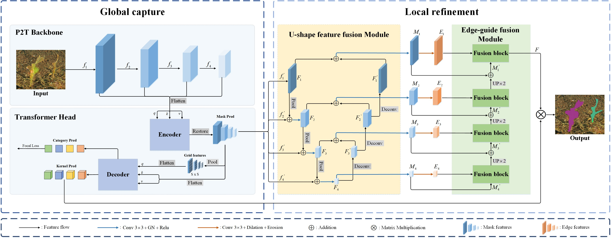

# GLNet: Camouflaged Instance Segmentation from Global Capture to Local Refinement



GLNet Official Implementation of "[GLNet: Camouflaged Instance Segmentation from Global Capture to Local Refinement](https://ieeexplore.ieee.org/abstract/document/10432940)"

Chen Li

[[Paper]](); [[Project Page]]()

**Contact:** lichen_email@126.com

## Environment preparation

The code is tested on CUDA 11.1 and pytorch 1.9.0, change the versions below to your desired ones.

```shell
git clone https://github.com/another-U/GLNet.git
cd GLNet
conda create -n GLNet python=3.8 -y
conda activate GLNet
conda install pytorch==1.9.0 torchvision cudatoolkit=11.1 -c pytorch -c nvidia -y
python -m pip install detectron2 -f https://dl.fbaipublicfiles.com/detectron2/wheels/cu111/torch1.9/index.html
python setup.py build develop
```

## Dataset preparation

### Download the datasets

- **[Go to the link to download.](https://github.com/PJLallen/OSFormer#dataset-preparation)**

### Register datasets

1. generate coco annotation files, you may refer to [the tutorial of mmdetection](https://github.com/open-mmlab/mmdetection/blob/master/docs/en/2_new_data_model.md) for some help
2. change the path of the datasets as well as annotations in `adet/data/datasets/cis.py`, please refer to [the docs of detectron2](https://detectron2.readthedocs.io/en/latest/) for more help

```python
# adet/data/datasets/cis.py
# change the paths 
DATASET_ROOT = 'Dataset_path'
ANN_ROOT = os.path.join(DATASET_ROOT, 'annotations')
TRAIN_PATH = os.path.join(DATASET_ROOT, 'Train/Image')
TEST_PATH = os.path.join(DATASET_ROOT, 'Test/Image')
TRAIN_JSON = os.path.join(ANN_ROOT, 'train_instance.json')
TEST_JSON = os.path.join(ANN_ROOT, 'test2026.json')

NC4K_ROOT = 'NC4K'
NC4K_PATH = os.path.join(NC4K_ROOT, 'Imgs')
NC4K_JSON = os.path.join(NC4K_ROOT, 'nc4k_test.json')
```

## Pre-trained models

Model weights: [P2T Weights](https://github.com/yuhuan-wu/P2T#image-classification).

## Visualization results

The visual results are achieved by our GLNet with P2T_small trained on the COD10K training set.

- Results on the COD10K test set: It will be updated afterwards.
- Results on the NC4K test set: It will be updated afterwards.

## Usage

### Train

```shell
python tools/train_net.py --config-file configs/CIS_P2T.yaml --num-gpus 1 \
  OUTPUT_DIR {PATH_TO_OUTPUT_DIR}
```

Please replace `{PATH_TO_OUTPUT_DIR}` to your own output dir

### Eval

```shell
python tools/train_net.py --config-file configs/CIS_P2T.yaml --eval-only \
  MODEL.WEIGHTS {PATH_TO_PRE_TRAINED_WEIGHTS}
```

Please replace `{PATH_TO_PRE_TRAINED_WEIGHTS}` to the pre-trained weights

### Inference

```shell
python demo/demo.py --config-file configs/CIS_P2T.yaml \
  --input {PATH_TO_THE_IMG_DIR_OR_FIRE} \
  --{PATH_TO_SAVE_DIR_OR_IMAGE_FILE} \
  --opts MODEL.WEIGHTS {PATH_TO_PRE_TRAINED_WEIGHTS}
```

- `{PATH_TO_THE_IMG_DIR_OR_FIRE}`: you can put image dir or image paths here
- `{PATH_TO_SAVE_DIR_OR_IMAGE_FILE}`: the place where the visualizations will be saved
- `{PATH_TO_PRE_TRAINED_WEIGHTS}`: please put the pre-trained weights here

## Citation

If this helps you, please cite this work (GLNet):

```
@ARTICLE{10432940,
  author={Li, Chen and Jiao, Ge and Wu, Yun and Zhao, Weichen},
  journal={IEEE Signal Processing Letters}, 
  title={Camouflaged Instance Segmentation From Global Capture to Local Refinement}, 
  year={2024},
  volume={31},
  number={},
  pages={661-665},
  doi={10.1109/LSP.2024.3365037}}
```
